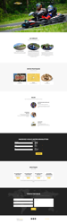
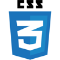

# Lockarting V2

> Vous pouvez retrouver mon code en ligne sur  https://www.lockarting.fr

## Fait avec :

## Travail effectué
* Refonte d'un site internet existant (2002)
* Formulaire de contact
* Mise en place d'une solution de vente de billeterie en ligne avec un widget weezevent
* Gestion des newsletters avec Mailchimp

## Travail en cours
* Revoir les conditions d'erreurs avec style de bootstrap.
* Refact le code pour une meilleure maintenance du site.
* Ajout d'un blog.

## TO BE CONTINUED...

